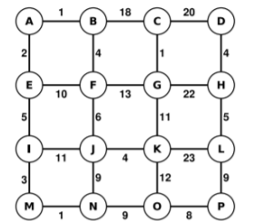

# 📃 Implementação 5

Esse repositório tem como finalidade a entrega e apresentação do trabalho "Implementação 5" da matéria de Estrutura de Dados I, desenvolvido pelas alunas:

<div align="center">
    <table>
        <tr>
            <td align="center">
                <a href="https://github.com/HeloisaRib">
                    
                    <br/>
                    <sub>Heloísa Ribeiro</sub>
                </a>
                <br />
                <a href="https://github.com/HeloisaRib" title="Code"></a>
            </td>
            <td align="center">
                <a href="https://github.com/yasminebelmiro">
                    
                    <br/>
                    <sub>Yasmine Belmiro</sub>
                </a>
                <br />
                <a href="https://github.com/yasminebelmiro" title="Code"></a>
            </td>
        </tr>
    </table>
</div>

## 🎈 Problema

Implementar um programa em Java que seja capaz de percorrer todas as cidades representadas no
grafo a seguir usando uma busca em profundidade através do emprego de uma pilha:

<div align="center">
    
</div>

O programa deve ser capaz de informar as seguintes questões:

- Se uma determinada cidade está presente ou não;
- Qual distância entre duas cidades (calcular o número cidades entre elas e não o valor das
  arestas (linhas));
- Quantas cidades tem o grafo;

## 🧮 Resolução

A solução foi implementada na linguagem Java, utilizando a representação de grafos por meio de **Listas de Adjacência**. Optou-se por essa abordagem em vez da Matriz de Adjacência pois ela otimiza significativamente o uso de memória em grafos esparsos, armazenando apenas as conexões reais de cada cidade.

Para atender aos requisitos do problema, implementamos o algoritmo de **Busca em Profundidade (DFS)** fazendo o uso explícito de uma estrutura de Pilha desenvolvida do zero.

O sistema foi dividido em quatro classes para melhor organização do código e das responsabilidades:

1. `Pilha.java`
   Implementação manual de uma estrutura de dados do tipo Pilha genérica (LIFO), desenvolvida a partir de uma lista subjacente. Contém as operações fundamentais (`push`, `pop`, `isEmpty`) para gerenciar as cidades visitadas durante a busca, atendendo à restrição do trabalho.

2. `Aresta.java`
   Tem como objetivo representar as conexões matemáticas entre os vértices do grafo. Ela atua como um objeto de ligação que armazena a cidade de destino e o custo do deslocamento até ela.

3. `Grafo.java`
   Tem como objetivo gerenciar a estrutura principal do grafo utilizando um `Map`, onde a chave é o nome da cidade e o valor é a lista de arestas adjacentes.

4. `Main.java`
   Seu objetivo é atuar como o ponto de entrada e ambiente de testes do programa. É responsável por instanciar o grafo, adicionar todas as arestas formadoras da malha apresentada na imagem do problema e, em seguida, executar os métodos para demonstrar os resultados no console.

---

### ✅ Requisitos da implementação

- **Verificar presença da cidade**:
  O método `buscarCidade(String inicio, String destino)` utiliza a nossa classe de Pilha para navegar pelos vizinhos utilizando a **Busca em Profundidade**. Ao desempilhar, verifica se o nó atual é o destino procurado.

- **Distância entre cidades:** O método `calculaDistanciaEntreCidades(String origem, String destino)` também utiliza a Pilha, mas armazena um objeto auxiliar interno (`Passo`), que guarda não apenas a cidade atual, mas a quantidade de saltos dados até chegar nela.

- **Quantidade de cidades:**
  O método `totalCidades()` simplesmente retorna o tamanho do `Map` de vértices, garantindo a contagem exata de nós únicos.

## 🎯 Saída

Ao executar a classe `Main.java`, o programa faz a montagem do grafo da imagem acima e procura por duas cidades, uma existente (`P`) e outra inexistente (`X`) partindo de `A`:

```java
// 2. Buscando cidades
boolean achouP = grafo.buscarCidade("A", "P");
boolean achouX = grafo.buscarCidade("A", "X"); // Cidade inexistente
```

Após a busca, a classe faz o calculo de distancia entre as cidades desejadas:

```java
// 3. Distância entre cidades
int distanciaA_P = grafo.calculaDistanciaEntreCidades("A", "P");
int distanciaA_F = grafo.calculaDistanciaEntreCidades("A", "F");
int distanciaA_X = grafo.calculaDistanciaEntreCidades("A", "X");
```

Devido à forma como as arestas foram adicionadas e ao comportamento característico da pilha, o algoritmo executa um efeito serpente pelas colunas do grafo.

Para encontrar a cidade "P" partindo de "A", o algoritmo passa exatamente pela seguinte sequência de cidades:

$$A \rightarrow E \rightarrow I \rightarrow M \rightarrow N \rightarrow J \rightarrow F \rightarrow B \rightarrow C \rightarrow G \rightarrow K \rightarrow O \rightarrow P$$

O programa gera o seguinte resultado no terminal demonstrando os passos e as distâncias (em saltos iterativos):

```plaintext
Quantidade total de cidades no grafo: 16

Cidade 'P' encontrada!
A cidade X não está presente no grafo!

Distância de 'A' até 'P': 12
Distância de 'A' até 'F': 6
Distância até 'X': -1
```
